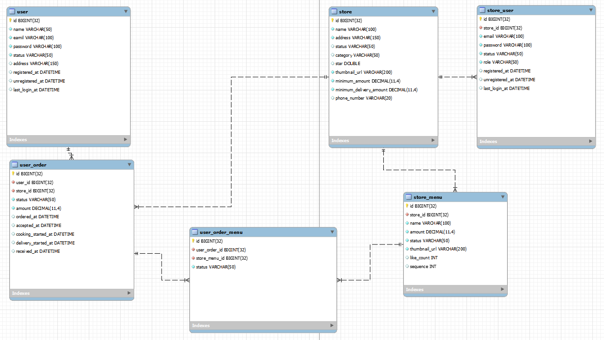

## 프로젝트 목표

- 배달플랫폼 서비스의 일부 기능을 구현하는 프로젝트이며 단순 기능 구현이 목적이 아닌   객체지향 원리 및 SW 디자인 패턴을 원칙 기반하여 올바른 코드를 작성하는데 목적을 두고 있습니다.

## 프로젝트 공통 준수사항
### URL 생성 규칙
- 모든 엔드포인트의 시작은 '/api' 라 명시한다.
- 검증이 필요없는 URL 은 '/open-api' 라 명시한다.
- url 의 PathVariable 은 PK 값만 허용한다.
-
### 기본 응답 
- 모든 응답은 공통 응답 객체에 담긴다. (데이터 구조에 대한 일관성 유지 목적)
- 모든 응답 필드는 SnakeCase 를 적용한다. (ex.snake_case) 
- 
### ExceptionHandling
- Exception 은 Handler 를 만들어 일관성 있게 처리한다.
- @RestControllerAdvice 를 만들어 예외를 일관성 있게 처리한다.
- 예외에 대한 응답 객체 또한 공통 응답 객체를 사용한다.
-

## 기술 스택
- **JDK 17**
- **Gradle** 
- **Spring Boot 3.1.9**
- **MySQL**  
- **Spring Data JPA**
- **Spring Security** 
- **Flyway Migration**
- **Rabbit MQ**
- **Docker**
- **Swagger**

## 브랜치 전략 
[우아한 형제들 기술 블로그 참고](http://woowabros.github.io/experience/2017/10/30/baemin-mobile-git-branch-strategy.html).
- Master : 배포시 사용합니다.
- Dev : 완전히 개발이 끝난 부분에 대해서만 Merge를 진행합니다.
- Feature : 기능 단위 개발을 진행할 때 사용합니다.
- Release : 배포 전 검증단계에서 사용합니다.
- Hot-Fix : 배포를 진행한 후 발생한 버그를 수정해야 할 때 사용합니다.

## ERD
